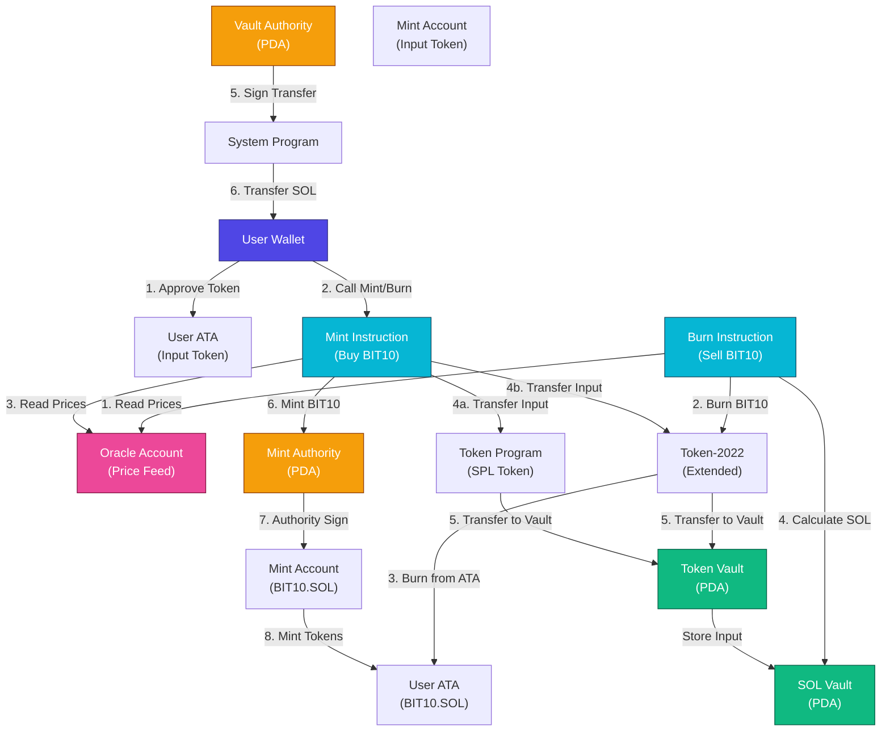

# BIT10 Exchange

BIT10 Exchange smart contract for buying (minting) or selling (burning) BIT10.SOL Index Token on Solana.

## 🌟 Overview

BIT10 Exchange is a decentralized protocol that enables users to mint and burn the BIT10.SOL index token, which tracks a weighted basket of the top 10 cryptocurrencies by market capitalization. The protocol supports multiple token standards (Token-Program and Token-2022) and integrates oracle price feeds for accurate asset valuations.

## 🌐 Core Features

- **Minting (Buy)**: Exchange SOL or USDC for BIT10.SOL tokens with automatic price calculation
- **Burning (Sell)**: Redeem BIT10.SOL tokens back to SOL with proper fee deduction
- **Multi-Token Support**: Compatible with both SPL Token (Token-Program) and Token-2022 standards
- **Oracle Integration**: Real-time price feeds for BIT10.SOL, SOL, and USDC
- **Index Tracking**: Automatically maintains weights based on top 10 token market caps
- **Fee Structure**: 0.5% fee applied on all swaps (5/1000 basis)
- **Comprehensive Logging**: Transaction tracking with swap IDs, timestamps, and USD valuations

## 📐 Architecture Overview



## 🔗 Solana Smart Contract

- Devnet BIT10 Exchange Smart Contract: [3M2PP2Ex85JoQEdQHjEBDCJ4YVR3RLXSkVoB1kwHhF8Q](https://solscan.io/account/3M2PP2Ex85JoQEdQHjEBDCJ4YVR3RLXSkVoB1kwHhF8Q?cluster=devnet)
- Mainnet BIT10 Exchange Smart Contract: [7CQDVZbDr9DtmzjYUFK2SM1GEGGc4o2qeYoUBfFyYb9N](https://solscan.io/account/7CQDVZbDr9DtmzjYUFK2SM1GEGGc4o2qeYoUBfFyYb9N)

## 🏁 Getting Started

To start using the BIT10 Exchange smart contract, follow these steps:

1. **Clone the Repository**:
    ```bash
    git clone https://github.com/ZeyaRabani/BIT10.git
    ```

2. **Go to bit10_exchange folder**:
    ```bash
    cd smart_contract/bit10_exchange
    ```

3. **Build and deploy the smart contract**:
    ```bash
    anchor build

    anchor deploy --provider.cluster devnet
    ```