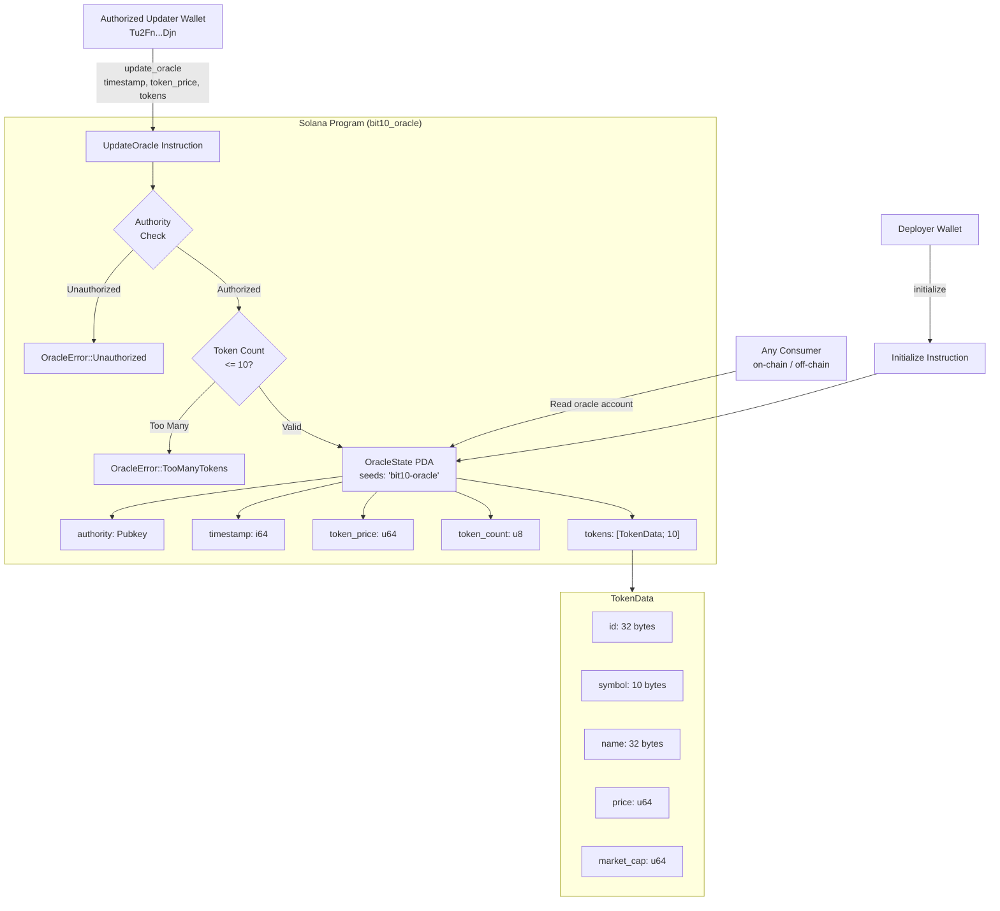

# BIT10 Oracle

Oracle smart contract for retrieving pricing and other data, such as rebalancing, for the BIT10 index fund.

## 🌟 Overview

BIT10 Oracle is an on-chain Solana smart contract built with the Anchor framework. It stores and exposes real-time token pricing and metadata for up to 10 assets that make up the BIT10 index fund. The oracle is updated by a single authorized wallet, ensuring data integrity while remaining publicly readable by any on-chain or off-chain consumer.

## 🌐 Core Features

- **Permissioned Updates** - Only a hardcoded authorized wallet (`Tu2Fn...Djn`) can push price updates, preventing unauthorized manipulation.
- **Index Price Tracking** - Maintains a single aggregated `token_price` representing the BIT10 index value alongside individual token data.
- **Timestamped State** - Every update records a Unix timestamp, allowing consumers to verify data freshness.
- **PDA-Based Account** - The oracle account is derived from a deterministic seed (`bit10-oracle`), making it easily discoverable without storing an address.
- **Anchor Framework** - Built with Anchor for type-safe instruction handling, account validation, and error management.

## 📐 Architecture Overview



## 🔗 Solana Smart Contract

- Devnet BIT10 Oracle Smart Contract: [9kWEcYpPbrB9C5yo9AKmS5HKHxqcwn4NzqhbJCsAh2bT](https://solscan.io/account/9kWEcYpPbrB9C5yo9AKmS5HKHxqcwn4NzqhbJCsAh2bT?cluster=devnet)
- Mainnet BIT10 Oracle Smart Contract: [AFAEYYsCPmwLsd97XWVJxbWnB7tHFqQ41hUZGK2fKWZX](https://solscan.io/account/AFAEYYsCPmwLsd97XWVJxbWnB7tHFqQ41hUZGK2fKWZX)

## 🏁 Getting Started

To start using the BIT10 Oracle smart contract, follow these steps:

1. **Clone the Repository**:
    ```bash
    git clone https://github.com/ZeyaRabani/BIT10.git
    ```

2. **Go to bit10_oracle folder**:
    ```bash
    cd smart_contract/bit10_oracle
    ```

3. **Build and deploy the smart contract**:
    ```bash
    anchor build

    anchor deploy --provider.cluster devnet
    ```